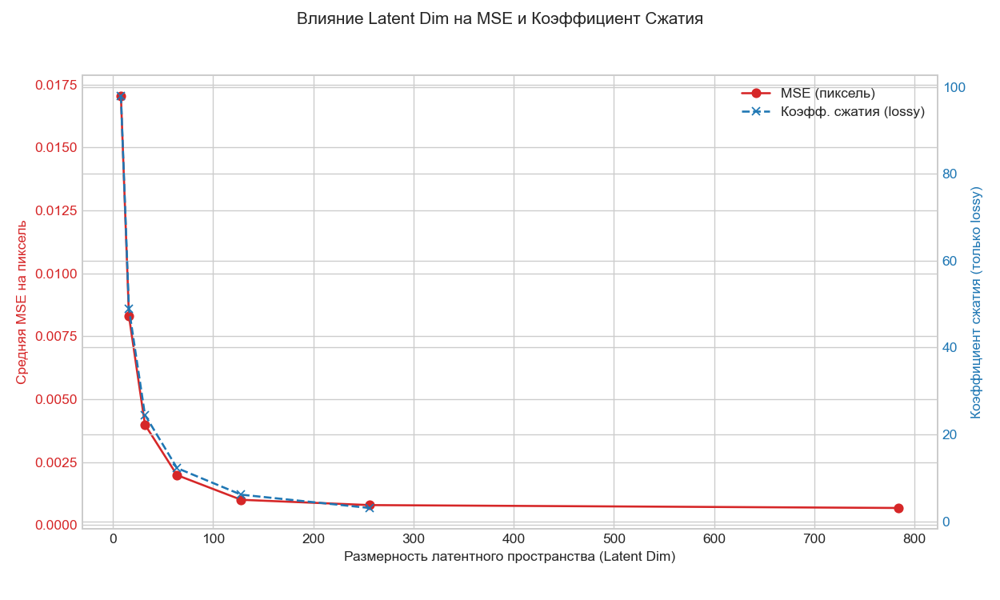

# Сжатие Изображений MNIST с Помощью Сверточных Автоэнкодеров

Этот проект реализует и сравнивает сверточные автоэнкодеры для сжатия изображений из датасета MNIST без потерь (lossless) и с потерями (lossy), а также исследует влияние размерности латентного пространства на качество сжатия с потерями.

## Описание Задачи

Цель работы — исследовать применение сверточных автоэнкодеров для задачи сжатия изображений. В рамках проекта реализованы:
*   Автоэнкодер для сжатия **без потерь** (lossless), обеспечивающий точную реконструкцию исходных данных.
*   Автоэнкодер для сжатия **с потерями** (lossy), позволяющий достичь различных степеней сжатия за счет контролируемой потери информации.
*   Проведен сравнительный анализ производительности обеих моделей.
*   Проведено исследование зависимости качества реконструкции и коэффициента сжатия от размерности латентного пространства для lossy-модели.
*   Результаты оценены количественно (MSE, коэффициент сжатия) и визуально (сравнение реконструкций, визуализация латентного пространства).

## Структура Проекта

```python
autoencoder-compression/
│
├── .gitignore
├── README.md # Данный файл отчета
├── requirements.txt # Зависимости Python
├── config.yaml # Файл конфигурации параметров
│
├── data/
│ └── MNIST/raw/ # Скачанные файлы датасета MNIST (.gz)
│
├── notebooks/
│ └── hyperparameter_study.ipynb # Jupyter Notebook для исследования latent_dim
│
├── src/ # Исходный код
│ ├── init.py
│ ├── data_loader.py # Загрузка и подготовка данных MNIST
│ ├── model.py # Определение архитектуры автоэнкодера (PyTorch)
│ ├── train.py # Скрипт для обучения моделей
│ ├── evaluate.py # Скрипт для оценки моделей (возвращает метрики)
│ └── visualize.py # Скрипт для генерации визуализаций
│
├── models/ # Сохраненные веса обученных моделей (.pth)
│
└── reports/
└── figures/ # Сгенерированные изображения и графики (.png)
├── lossy_ld8/ # Визуализации для ld=8
├── lossy_ld16/ # Визуализации для ld=16
│ ... (и т.д.)
└── reconstructions_comparison.png # Общее сравнение
└── latent_dim_vs_metrics.png # График зависимости метрик
```

## Используемые библиотеки

*   Python 3.x
*   PyTorch (torch, torchvision)
*   NumPy
*   Matplotlib
*   Scikit-learn (для t-SNE/PCA)
*   PyYAML (для конфигурации)
*   Pandas (в ноутбуке для анализа результатов)
*   tqdm (для индикаторов прогресса)
*   Jupyter Notebook/Lab (для запуска `hyperparameter_study.ipynb`)

## Датасет

*   **Название:** MNIST
*   **Описание:** Датасет рукописных цифр (0-9).
*   **Размер:** 60,000 тренировочных и 10,000 тестовых изображений.
*   **Формат:** 28x28 пикселей, черно-белые (1 канал). Размерность входа: 784.
*   **Предобработка:** Изображения преобразованы в тензоры PyTorch и нормализованы к диапазону [0, 1].

## Архитектура Автоэнкодера

Используется сверточный автоэнкодер:
*   **Энкодер:** Состоит из последовательности слоев `Conv2d` с активацией `ReLU` и увеличением количества каналов, использующих `stride=2` для уменьшения пространственной размерности. Завершается слоем `Flatten` и полносвязным слоем (`Linear`) для формирования латентного вектора заданной размерности (`latent_dim`).
*   **Декодер:** Выполняет обратные операции. Начинается с полносвязного слоя и `Unflatten` для подготовки данных к сверткам. Затем используются слои `ConvTranspose2d` (с `stride=2`) и `ReLU` для увеличения пространственной размерности и уменьшения числа каналов. Последний слой `ConvTranspose2d` восстанавливает исходное количество каналов (1) и использует активацию `Sigmoid` для получения значений пикселей в диапазоне [0, 1].

Размерность латентного пространства (`latent_dim`) определяет тип сжатия:
*   **Lossless:** `latent_dim` = 784 (в данном проекте). Цель - минимизировать ошибку реконструкции (MSE).
*   **Lossy:** `latent_dim` < 784. Модель вынуждена учить сжатое представление, отбрасывая часть информации.

## Конфигурация (`config.yaml`)

Основные параметры, настраиваемые в `config.yaml`:
*   `data_dir`: Путь к папке с данными (относительно корня проекта).
*   `model_save_dir`: Путь к папке для сохранения моделей.
*   `results_save_dir`: Путь к папке для сохранения визуализаций.
*   `batch_size`: Размер батча для обучения/оценки.
*   `model_type`: Тип модели для обучения/оценки ("lossy" или "lossless").
*   `latent_dim_lossy`: Размерность латентного пространства для lossy-модели (используется при `model_type: lossy`).
*   `latent_dim_lossless`: Размерность латентного пространства для lossless-модели (используется при `model_type: lossless`).
*   `learning_rate`: Скорость обучения для оптимизатора Adam.
*   `num_epochs`: Количество эпох обучения.
*   `device`: Устройство для вычислений ("cuda", "mps", "cpu" или "auto").

## Установка

1.  Клонируйте репозиторий:
    ```bash
    git clone <URL вашего репозитория>
    cd autoencoder-compression
    ```
    
2.  Создайте и активируйте виртуальное окружение (рекомендуется):
    ```bash
    python -m venv .venv
    # Linux/macOS: source .venv/bin/activate
    # Windows: .\.venv\Scripts\activate
    ```
    
3.  Установите зависимости:
    ```bash
    pip install -r requirements.txt
    ```

## Использование

### 1. Обучение моделей

*   Настройте параметры в `config.yaml` (`model_type`, `latent_dim_*`, `num_epochs` и т.д.).
*   Запустите обучение из **корневой папки** проекта:
    ```bash
    python src/train.py --config config.yaml
    ```
    Модели сохраняются в `models/`. Обучите lossy и lossless модели.

### 2. Оценка моделей

*   Установите `model_type` в `config.yaml` для нужной модели.
*   Запустите оценку из корня проекта:
    ```bash
    python src/evaluate.py --config config.yaml
    ```
    Результаты будут выведены в консоль (скрипт также возвращает словарь с результатами).

### 3. Визуализация

*   Убедитесь, что **обе** модели (lossy и lossless, соответствующие параметрам в конфиге для сравнения реконструкций) и **все lossy** модели для исследования (из ноутбука) обучены и сохранены.
*   Запустите генерацию визуализаций из корня проекта:
    ```bash
    python src/visualize.py --config config.yaml
    ```
    Общий график сравнения реконструкций сохранится в `reports/figures/`. Графики латентного пространства и многообразия для каждой найденной lossy-модели сохранятся в подпапки `reports/figures/lossy_ld<XXX>/`.

### 4. Исследование `latent_dim` (Jupyter Notebook)

*   Установите `jupyterlab` и `pandas` (`pip install jupyterlab pandas`).
*   Запустите Jupyter Lab/Notebook из **корневой папки** проекта: `jupyter lab`.
*   Откройте `notebooks/hyperparameter_study.ipynb`.
*   Настройте список `latent_dims_to_test` и запустите ячейки. **Внимание:** Обучение для каждого `latent_dim` занимает время.
*   Результаты будут собраны в таблицу и визуализированы в ноутбуке.

## Результаты

### Метрики Качества и Влияние `latent_dim`

Сводная таблица результатов, полученная с помощью `notebooks/hyperparameter_study.ipynb`:

| model_type | latent_dim | eval_success | mse_pixel | compression_ratio |
| :--------: | :--------: | :----------: | :-------: | :---------------: |
|   lossy    |     8      |     True     | 0.017052  |        98         |
|   lossy    |     16     |     True     | 0.008305  |        49         |
|   lossy    |     32     |     True     | 0.003984  |       24.5        |
|   lossy    |     64     |     True     | 0.001980  |       12.25       |
|   lossy    |    128     |     True     | 0.001001  |       6.125       |
|   lossy    |    256     |     True     | 0.000790  |      3.0625       |
|  lossless  |    784     |     True     | 0.000675  |         1         |

График зависимости MSE (все модели) и коэффициента сжатия (только lossy) от `latent_dim`:




### Визуальное Сравнение Реконструкций (Lossless ld=784, Lossy ld=64)


### Визуализация Латентного Пространства (Примеры)

Визуализации генерируются для всех найденных lossy-моделей в соответствующие подпапки `reports/figures/lossy_ld<XXX>/`. Ниже приведены примеры для `ld=8` (максимальное сжатие) и `ld=64` ("среднее" сжатие). Визуализации для `lossless` (ld=784) не генерировались.

**Модель Lossy ld=8:**

*   **t-SNE Scatter Plot:**
    
*   **t-SNE Manifold:**
    

**Модель Lossy ld=64:**

*   **t-SNE Scatter Plot:**
    
*   **t-SNE Manifold:**
    

## Обсуждение и Выводы

*   **Компромисс Качество-Сжатие:** Таблица и график наглядно иллюстрируют обратную зависимость между коэффициентом сжатия и качеством реконструкции (измеряемым как MSE). Уменьшение `latent_dim` с 784 до 8 увеличивает коэффициент сжатия с 1x до 98x, но MSE при этом возрастает примерно в 25 раз (с ~0.0007 до ~0.017). Наиболее резкое падение MSE наблюдается при увеличении `latent_dim` в диапазоне малых значений (8-64), после чего улучшение качества становится менее выраженным.
*   **Lossless vs Lossy:** Модель Lossless (ld=784) достигает наименьшей ошибки MSE (0.000675), что соответствует практически идеальной реконструкции (визуально неотличимой от оригинала), но не обеспечивает реального сжатия в латентном пространстве (коэффициент сжатия 1x). Модели Lossy позволяют существенно уменьшить размерность данных, но вносят искажения. Даже при ld=256 (сжатие ~3x) ошибка MSE заметно выше, чем у lossless. Визуально, lossy-реконструкции (особенно при малых `ld`) могут выглядеть несколько размытыми.
*   **Структура Латентного Пространства:** Визуализации t-SNE/PCA показывают, что даже при сильном сжатии (ld=8), энкодер способен группировать схожие цифры в латентном пространстве, хотя кластеры могут частично пересекаться. При увеличении `latent_dim` (например, ld=64) кластеризация становится более четкой, а переходы на "многообразии" (manifold) - более плавными, что свидетельствует об изучении более качественных признаков.
*   **Выбор Оптимального `latent_dim`:** Зависит от задачи. Если требуется максимальное качество - используется lossless. Если допустимы потери ради сжатия, то выбор `latent_dim` (например, 32, 64 или 128) определяется балансом между приемлемым MSE/визуальным качеством и желаемым коэффициентом сжатия.
*   **Заключение:** Сверточные автоэнкодеры продемонстрировали свою эффективность для задачи сжатия изображений MNIST, позволяя как почти идеально реконструировать данные (lossless), так и достигать значительного сжатия с контролируемыми потерями (lossy). Анализ латентного пространства подтвердил способность моделей к изучению содержательных представлений данных.